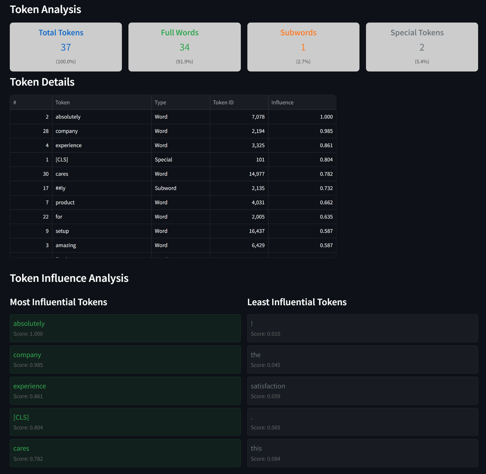

# Transfer Learning in Sentiment Analysis - 42 Urduliz AI Project
Author: [Juan Carlos Cordon](https://github.com/jcdata42/transfer_learning_project)

## Project Overview

This project is an introduction to **Transfer Learning** in the field of **Sentiment Analysis**. Sentiment analysis, a key technique in **Natural Language Processing (NLP)**, allows us to determine whether a piece of text conveys a positive or negative sentiment. By using transfer learning, we can leverage pretrained models to build highly effective sentiment analysis systems with less training data and computational resources.

The project focuses on developing a binary sentiment analysis model using transfer learning techniques. It encourages students to explore various **pretrained models**, experiment with **tokenization methods**, and tune **hyperparameters** to optimize model performance while considering constraints like **computing resources** and **dataset size**.

## Aim of the Project

The aim of this project is to provide students with practical experience in the following areas:

1. **Transfer Learning**: Using models that have been pre-trained on large datasets to adapt them to a specific task like sentiment analysis. Students will research and select models such as **BERT**, **RoBERTa**, **GPT-2**, or **DistilBERT**, among others.
   
2. **Sentiment Analysis**: Implementing a binary sentiment classification system to categorize text (such as reviews) as either positive or negative.

3. **Tokenization Techniques**: Exploring different tokenization methods that convert text into the format that can be processed by the chosen pretrained model.

4. **Hyperparameter Tuning**: Optimizing key hyperparameters such as **learning rate**, **batch size**, and **number of epochs** to improve model performance.

5. **Resource Efficiency**: Given the constrained computing resources, students are expected to experiment with smaller models and reduced dataset sizes to ensure that training is feasible within limited computational environments.

6. **Generalization and Evaluation**: Evaluating the model's accuracy on a test set and ensuring it can generalize well to unseen data.

## Learning Objectives

By completing this project, students will:
- Understand the basic principles of transfer learning and its application in NLP tasks like sentiment analysis.
- Gain hands-on experience in fine-tuning pretrained models for specific tasks.
- Develop a deep understanding of the importance of tokenization and its role in processing textual data.
- Learn to adapt models and datasets to fit within resource constraints, making the most of available computational power.
- Implement and evaluate models, and present their results with a clear understanding of the model’s performance.

## Key Features

- **Pretrained Model Selection**: Students are free to choose from a range of pretrained models (e.g., BERT, RoBERTa) depending on their research and project needs.
- **Flexible Resources**: The project can be implemented on **cloud** or **local computing resources**, with **sgoinfre** being a recommended resource.
- **Hands-on Approach**: This project is designed to be highly customizable, allowing students to explore different approaches and methodologies according to their interests and expertise.
- **Peer Evaluation**: Upon completion, the project will be evaluated based on the clarity, structure, and functionality of the submitted work.

## Bonus Challenges

- Test your model on additional datasets to evaluate its generalization abilities.
- Explore multiple tokenization techniques and compare their performance.
- Deploy the trained model to the web, allowing real-time sentiment predictions via a user interface.

---
---

## 🤖 MY Implementation Guide
Author: [Diego Gerwig López](https://github.com/diegogerwig)

1. **Setup and Environment**
   - Install required Python packages: torch, transformers, pandas, scikit-learn, datasets
   - Configure CUDA for GPU acceleration if available
   - Verify system resources (CPU, RAM, GPU)

2. **Data Preparation**
   - Load datasets from Hugging Face (IMDB) and local files
   - Analyze dataset characteristics (size, distribution, text length)
   - Generate data reports using ydata-profiling
   - Split data into train/validation/test sets (70/10/20)

3. **Model Selection and Evaluation**
   - Compare different transformer models:
     - DistilBERT (selected for efficiency)
     - BERT
     - RoBERTa
   - Analyze model characteristics (size, speed, memory usage)
   - Test tokenization approaches

4. **Hyperparameter Optimization**
   - Implement grid search with cross-validation
   - Parameters tuned:
     - Learning rate: 3e-5, 5e-5
     - Batch size: 16, 32
     - Dropout: 0.1, 0.15
     - Weight decay: 0.005, 0.01
     - Number of epochs: 3, 4

5. **Model Training**
   - Initialize DistilBERT with optimal parameters
   - Implement early stopping
   - Use AdamW optimizer with weight decay
   - Apply linear learning rate scheduling with warmup
   - Monitor training metrics (loss, accuracy)

6. **Evaluation and Results**
   - Calculate test set metrics:
     - Accuracy
     - F1 score
     - Classification report
   - Plot training history
   - Save trained model and tokenizer

---
---

## 💫 Live Demo 💫

Try out the sentiment analysis model in our [Streamlit web app](https://42-llm.streamlit.app/)

The web interface allows you to input text and get instant sentiment predictions using our fine-tuned DistilBERT model.

